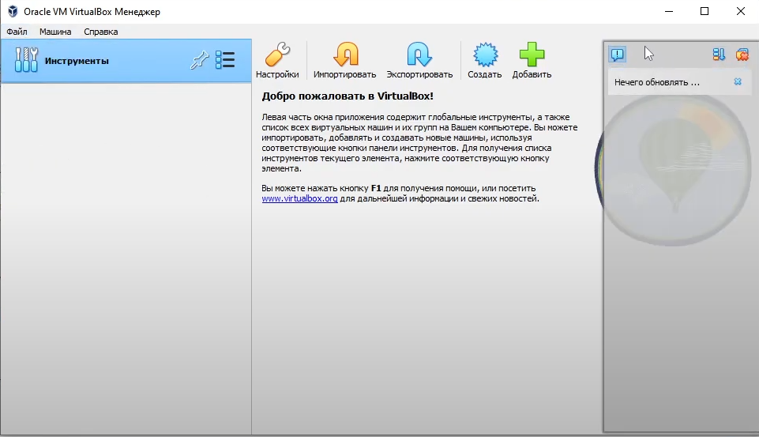
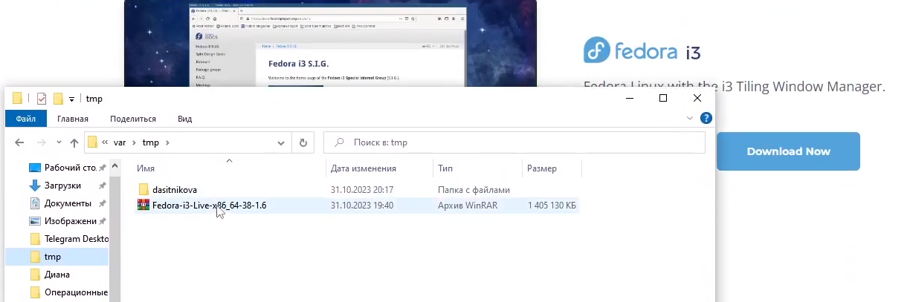
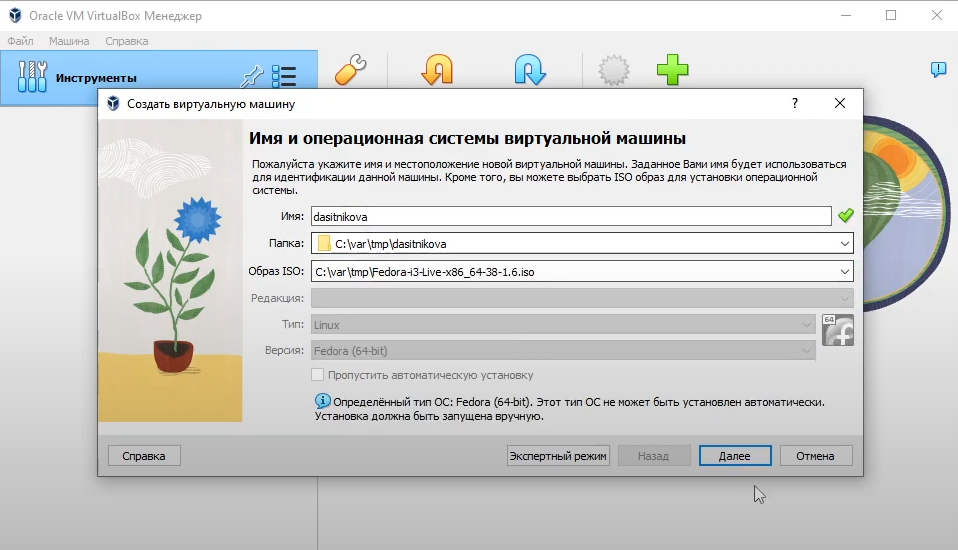
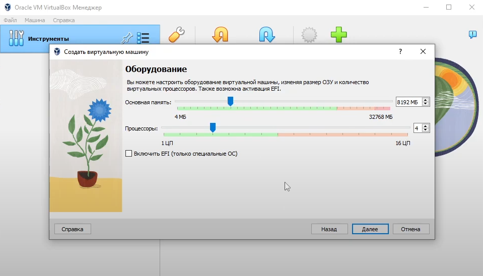
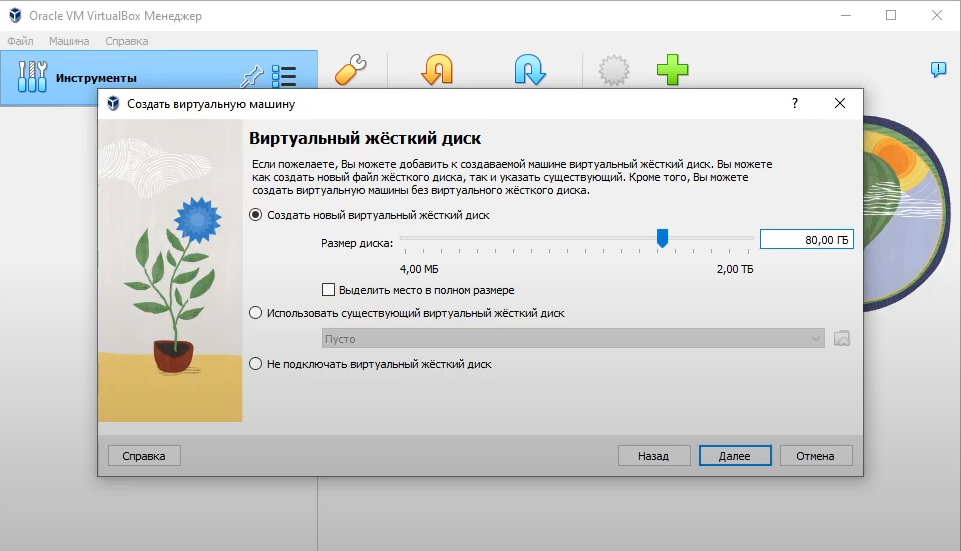

---
## Front matter
title: Отчет по лабораторной работе №1
subtitle: "Дисциплина: Операционные системы"
author: "Ситникова Диана Александровна"
description: "Группа: НПИбд-01-22"
date: "Москва 2023г"

## Generic otions
lang: ru-RU
toc-title: "Содержание"

## Bibliography
bibliography: bib/cite.bib
csl: pandoc/csl/gost-r-7-0-5-2008-numeric.csl

## Pdf output format
toc: true # Table of contents
toc-depth: 2
lof: true # List of figures
lot: true # List of tables
fontsize: 12pt
linestretch: 1.5
papersize: a4
documentclass: scrreprt
## I18n polyglossia
polyglossia-lang:
  name: russian
  options:
    - spelling=modern
    - babelshorthands=true
polyglossia-otherlangs:
  name: english
## I18n babel
babel-lang: russian
babel-otherlangs: english
## Fonts
mainfont: PT Serif
romanfont: PT Serif
sansfont: PT Sans
monofont: PT Mono
mainfontoptions: Ligatures=TeX
romanfontoptions: Ligatures=TeX
sansfontoptions: Ligatures=TeX,Scale=MatchLowercase
monofontoptions: Scale=MatchLowercase,Scale=0.9
## Biblatex
biblatex: true
biblio-style: "gost-numeric"
biblatexoptions:
  - parentracker=true
  - backend=biber
  - hyperref=auto
  - language=auto
  - autolang=other*
  - citestyle=gost-numeric
## Pandoc-crossref LaTeX customization
figureTitle: "Рис."
tableTitle: "Таблица"
listingTitle: "Листинг"
lofTitle: "Список иллюстраций"
lolTitle: "Листинги"
## Misc options
indent: true
header-includes:
  - \usepackage{indentfirst}
  - \usepackage{float} # keep figures where there are in the text
  - \floatplacement{figure}{H} # keep figures where there are in the text
---

# Цель работы

Целью данной работы является приобретение практических навыков установки операционной системы на виртуальную машину, настройки минимально необходимых для дальнейшей работы сервисов.

# Выполнение лабораторной работы

## Установка программного обеспечения

Произведём скачивание и установку виртуальной машины через сайт(рис. [-@fig:001])  
{ #fig:001 width=100% }  
[https://www.virtualbox.org/](https://www.virtualbox.org/)  
Далее скачаем дистрибутив Linux Fedora-35(рис. [-@fig:002])  
{ #fig:002 width=100% }  
[https://getfedora.org/ru/workstation/download](https://fedoraproject.org/spins/i3/download/)

## Создание виртуальной машины

* Запустите менеджер виртуальных машин.  
* Создайте новую виртуальную машину.  
* Укажите имя виртуальной машины (ваш логин в дисплейном классе), тип операционной системы — Linux, Fedora(рис. [-@fig:003])  
{ #fig:003 width=100% }  
* Укажите размер основной памяти виртуальной машины — от 2048 МБ(рис. [-@fig:004])  
{ #fig:004 width=100% }  
* Задайте конфигурацию жёсткого диска — загрузочный, VDI (VirtualBox Disk Image), динамический виртуальный диск.  
* Задайте размер диска — 80 ГБ (или больше), его расположение — в данном случае /var/tmp/имя_пользователя/fedora.vdi(рис. [-@fig:005])  
{ #fig:005 width=100% }  
* Выберите в VirtualBox Вашей виртуальной машины. Добавьте новый привод оптических дисков и выберите образ.  
* При установке на собственной технике используйте скачанный образ операционной системы Fedora(рис. [-@fig:006])  
{ #fig:006 width=100% }  
* Общий вид виртуальной машины(рис. [-@fig:007]):  
{ #fig:007 width=100% }  
* Настройка виртуальной машины на двунаправленый буфер обмена(рис. [-@fig:008]):  
{ #fig:008 width=100% }  

## Установка операционной системы

* Запуск приложения для установки системы
  * Загрузите LiveCD(рис. [-@fig:009]):  
{ #fig:009 width=100% }  
  * Появится интерфейс начальной конфигурации.  
  * Нажмите Enter для создания конфигурации по умолчанию(рис. [-@fig:010]):  
{ #fig:010 width=100% }  
  * Нажмите Enter, чтобы выбрать в качестве модификатора клавишу Win (она же клавиша Super)(рис. [-@fig:011]):  
{ #fig:011 width=100% }  
  * В файле конфигурации эта клавиша будет обозначена как $Mod.
  * Нажмите комбинацию Win+Enter для запуска терминала.
  * В терминале запустите liveinst(рис. [-@fig:012]):  
{ #fig:012 width=100% }  
  * Для перехода к раскладке окон с табами нажмите Win+w.

* Установка системы на диск
  * Выберите язык интерфейса и перейдите к настройкам установки операционной системы(рис. [-@fig:013]):  
{ #fig:013 width=100% }  
  * При необходимости скорректируйте часовой пояс, раскладку клавиатуры (рекомендуется в качестве языка по умолчанию указать английский язык).
  * Место установки ОС оставьте без изменения(рис. [-@fig:014]):  
{ #fig:014 width=100% }  
  * Установите имя и пароль для пользователя root(рис. [-@fig:016]):  
{ #fig:016 width=100% }
  * Установите имя и пароль для Вашего пользователя(рис. [-@fig:017]):  
{ #fig:017 width=100% }
  * Задайте сетевое имя Вашего компьютера(рис. [-@fig:015]):  
{ #fig:015 width=100% }  
  * После завершения установки операционной системы корректно перезапустите виртуальную машину(рис. [-@fig:018]):  
{ #fig:018 width=100% }  
  * В VirtualBox оптический диск должен отключиться автоматически, но если это не произошло, то необходимо отключить носитель информации с образом(рис. [-@fig:020]):  
{ #fig:020 width=100% }  

## После установки

* Войдите в ОС под заданной вами при установке учётной записью.
* Нажмите комбинацию Win+Enter для запуска терминала.
* Переключитесь на роль супер-пользователя:  
  sudo -i
* Обновить все пакеты
  dnf -y update
* Установить программы для удобства работы в консоли:
  dnf install tmux mc
* При необходимости можно использовать автоматическое обновление.
* Установка программного обеспечения:  
  dnf install dnf-automatic
* Задаёте необходимую конфигурацию в файле /etc/dnf/automatic.conf.
* Запустите таймер:
  systemctl enable --now dnf-automatic.timer
* В данном курсе мы не будем рассматривать работу с системой безопасности SELinux. Поэтому отключим его:  
  * В файле /etc/selinux/config замените значение **SELINUX=enforcing** на значение **SELINUX=permissive**
  * Перегрузите виртуальную машину: **reboot**

## Установка драйверов для VirtualBox

* Войдите в ОС под заданной вами при установке учётной записью.
* Нажмите комбинацию Win+Enter для запуска терминала.
* Запустите терминальный мультиплексор tmux:  
  tmux
* Переключитесь на роль супер-пользователя:
  sudo -i
* Установите пакет DKMS:
  dnf -y install dkms
* В меню виртуальной машины подключите образ диска дополнений гостевой ОС.
* Подмонтируйте диск:
  mount /dev/sr0 /media
* Установите драйвера:  
  /media/VBoxLinuxAdditions.run
* Перегрузите виртуальную машину:
  reboot

## Настройка раскладки клавиатуры

* Войдите в ОС под заданной вами при установке учётной записью.
* Нажмите комбинацию Win+Enter для запуска терминала.
* Запустите терминальный мультиплексор tmux:  
  tmux
* Переключитесь на роль супер-пользователя:
  sudo -i
* Отредактируйте конфигурационный файл /etc/X11/xorg.conf.d/00-keyboard.conf:
  Section "InputClass"  
        Identifier "system-keyboard"  
        MatchIsKeyboard "on"  
        Option "XkbLayout" "us,ru"  
        Option "XkbVariant" ",winkeys"  
        Option "XkbOptions" "grp:rctrl_toggle,compose:ralt,terminate:ctrl_alt_bksp"
  EndSection  
* Для этого можно использовать файловый менеджер mc и его встроенный редактор.
* Перегрузите виртуальную машину:
  reboot

## Установка имени пользователя и названия хоста

* Если при установке виртуальной машины вы задали имя пользователя или имя хоста, не удовлетворяющее соглашению об именовании, то вам необходимо исправить это.
* Запустите виртуальную машину и залогиньтесь.
* Нажмите комбинацию Win+Enter для запуска терминала.
* Запустите терминальный мультиплексор tmux:  
  tmux
* Переключитесь на роль супер-пользователя:
  sudo -i
* Создайте пользователя (вместо username укажите ваш логин в дисплейном классе):  
  adduser -G wheel username
* Задайте пароль для пользователя (вместо username укажите ваш логин в дисплейном классе):
  passwd username
* Установите имя хоста (вместо username укажите ваш логин в дисплейном классе):
  hostnamectl set-hostname username
* Проверьте, что имя хоста установлено верно:
  hostnamectl

## Установка программного обеспечения для создания документации

* Войдите в ОС под заданной вами при установке учётной записью.
* Нажмите комбинацию Win+Enter для запуска терминала.
* Запустите терминальный мультиплексор tmux:  
  tmux
* Переключитесь на роль супер-пользователя:
  sudo -i
* Установим pandoc:
  dnf -y install pandoc
* Установите необходимые расширения:
  pip install pandoc-fignos pandoc-eqnos pandoc-tablenos pandoc-secnos --user
* Установим дистрибутив TeXlive:
* dnf -y install texlive texlive-\*

## Домашнее задание

* Дождитесь загрузки графического окружения и откройте терминал. В окне терминала проанализируйте последовательность загрузки системы, выполнив команду dmesg. Можно просто просмотреть вывод этой команды:
  dmesg | less
* Можно использовать поиск с помощью grep:
  dmesg | grep -i "то, что ищем"
* Получите следующую информацию:  
  * Версия ядра Linux (Linux version).
  * Частота процессора (Detected Mhz processor).
  * Модель процессора (CPU0).
  * Объём доступной оперативной памяти (Memory available).
  * Тип обнаруженного гипервизора (Hypervisor detected).
  * Тип файловой системы корневого раздела.
  * Последовательность монтирования файловых систем.

# Контрольные вопросы

1. **Какую информацию содержит учётная запись пользователя?**  
   
2. **Укажите команды терминала и приведите примеры:**  
   * для получения справки по команде: 
   * для перемещения по файловой системе: 
   * для просмотра содержимого каталога: 
   * для определения объёма каталога: 
   * для создания / удаления каталогов / файлов: 
   * для задания определённых прав на файл / каталог: 
   * для просмотра истории команд: 
3. **Что такое файловая система? Приведите примеры с краткой характеристикой.**  
   
4. **Как посмотреть, какие файловые системы подмонтированы в ОС?**
  
5. **Как удалить зависший процесс?**
  

# Выводы

