---
## Front matter
title: Отчет по лабораторной работе №1
subtitle: "Дисциплина: Операционные системы"
author: "Ситникова Диана Александровна"
description: "Группа: НПИбд-01-22"
date: "Москва 2023г"

## Generic otions
lang: ru-RU
toc-title: "Содержание"

## Bibliography
bibliography: bib/cite.bib
csl: pandoc/csl/gost-r-7-0-5-2008-numeric.csl

## Pdf output format
toc: true # Table of contents
toc-depth: 2
lof: true # List of figures
lot: true # List of tables
fontsize: 12pt
linestretch: 1.5
papersize: a4
documentclass: scrreprt
## I18n polyglossia
polyglossia-lang:
  name: russian
  options:
    - spelling=modern
    - babelshorthands=true
polyglossia-otherlangs:
  name: english
## I18n babel
babel-lang: russian
babel-otherlangs: english
## Fonts
mainfont: PT Serif
romanfont: PT Serif
sansfont: PT Sans
monofont: PT Mono
mainfontoptions: Ligatures=TeX
romanfontoptions: Ligatures=TeX
sansfontoptions: Ligatures=TeX,Scale=MatchLowercase
monofontoptions: Scale=MatchLowercase,Scale=0.9
## Biblatex
biblatex: true
biblio-style: "gost-numeric"
biblatexoptions:
  - parentracker=true
  - backend=biber
  - hyperref=auto
  - language=auto
  - autolang=other*
  - citestyle=gost-numeric
## Pandoc-crossref LaTeX customization
figureTitle: "Рис."
tableTitle: "Таблица"
listingTitle: "Листинг"
lofTitle: "Список иллюстраций"
lolTitle: "Листинги"
## Misc options
indent: true
header-includes:
  - \usepackage{indentfirst}
  - \usepackage{float} # keep figures where there are in the text
  - \floatplacement{figure}{H} # keep figures where there are in the text
---

# Цель работы

Целью данной работы является приобретение практических навыков установки операционной системы на виртуальную машину, настройки минимально необходимых для дальнейшей работы сервисов.

# Выполнение лабораторной работы

## Установка программного обеспечения

Произведём скачивание и установку виртуальной машины через сайт(рис. [-@fig:001]):  
{ #fig:001 width=100% }  
[https://www.virtualbox.org/](https://www.virtualbox.org/)  
Далее скачаем дистрибутив Linux Fedora-35(рис. [-@fig:002]):  
{ #fig:002 width=100% }  
[https://getfedora.org/ru/workstation/download](https://fedoraproject.org/spins/i3/download/)

## Создание виртуальной машины

* Запустите менеджер виртуальных машин.  
* Создайте новую виртуальную машину.  
* Укажите имя виртуальной машины (ваш логин в дисплейном классе), тип операционной системы — Linux, Fedora(рис. [-@fig:003]):  
{ #fig:003 width=100% }  
* Укажите размер основной памяти виртуальной машины — от 2048 МБ(рис. [-@fig:004]):  
{ #fig:004 width=100% }  
* Задайте конфигурацию жёсткого диска — загрузочный, VDI (VirtualBox Disk Image), динамический виртуальный диск.  
* Задайте размер диска — 80 ГБ (или больше), его расположение — в данном случае /var/tmp/имя_пользователя/fedora.vdi(рис. [-@fig:005]):  
{ #fig:005 width=100% }  
* Выберите в VirtualBox Вашей виртуальной машины. Добавьте новый привод оптических дисков и выберите образ.  
* При установке на собственной технике используйте скачанный образ операционной системы Fedora(рис. [-@fig:006]):  
{ #fig:006 width=100% }  

## Созданиче ключа ssh

* по алгоритму rsa с ключём размером 4096 бит:  
  ssh-keygen -t rsa -b 4096  
  (см. "Рис5")  
* для копирования ключа нам понадобится команда:  
  cat ~/.ssh/id_rsa.pub(рис. [-@fig:006])  
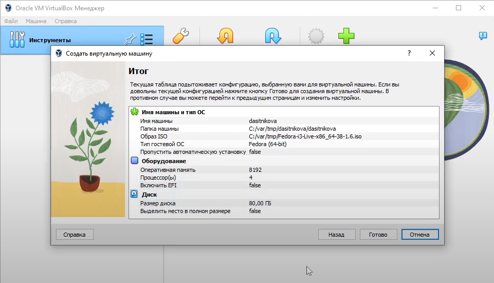{ #fig:001 width=100% }  
* далее добавляем скопированный ключ SSH на GitHub:(рис. [-@fig:007])  
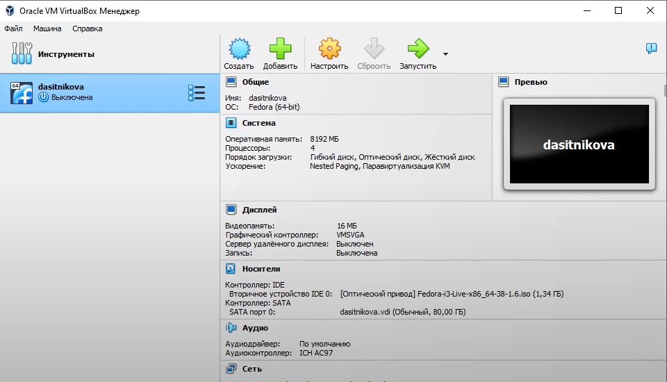{ #fig:001 width=100% }

## Создание ключа pgp

* Генерируем ключ при помощи команды:  
  gpg --full-generate-key
* Из предложенных опций выбираем:
  * тип RSA and RSA;
  * размер 4096;
  * выберите срок действия; значение по умолчанию — 0 (срок действия не истекает никогда).
* GPG запросит личную информацию, которая сохранится в ключе:
  * Имя (не менее 5 символов).
  * Адрес электронной почты.
    * При вводе email убедитесь, что он соответствует адресу, используемому на GitHub.
  * Комментарий. Можно ввести что угодно или нажать клавишу ввода, чтобы оставить это поле пустым.(рис. [-@fig:008])(рис. [-@fig:009])  
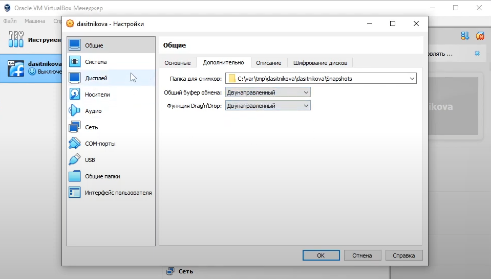{ #fig:001 width=100% }  
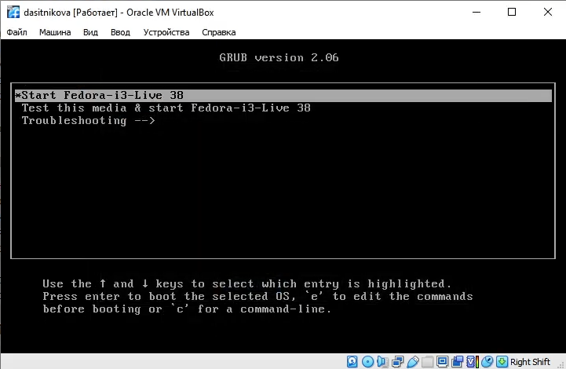{ #fig:001 width=100% }

## Добавление PGP ключа в GitHub

* Выводим список ключей и копируем отпечаток приватного ключа:
  gpg --list-secret-keys --keyid-format LONG
* Отпечаток ключа — это последовательность байтов, используемая для идентификации более длинного, по сравнению с самим отпечатком ключа.
* Формат строки:  
  sec   Алгоритм/Отпечаток_ключа Дата_создания [Флаги] [Годен_до]
      ID_ключа(рис. [-@fig:010])  
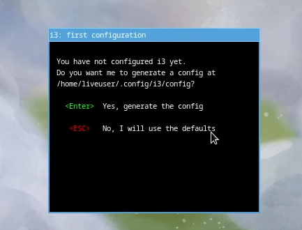{ #fig:001 width=100% }  
* Cкопируйте ваш сгенерированный PGP ключ в буфер обмена:  
  gpg --armor --export <PGP Fingerprint> | xclip -sel clip(рис. [-@fig:011])  
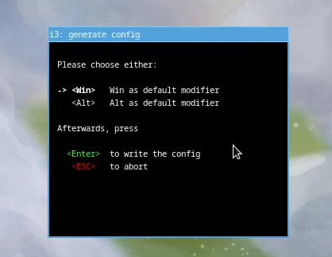{ #fig:001 width=100% }  
Примечание: я использовала в качестве параметра <PGP Fingerprint> свою почту, указанную при создании ключа PGP, однако, корректнее было бы использовать "Отпечаток_ключа" как на "Рис10" - A014F1F727513168.
* Перейдите в настройки GitHub (https://github.com/settings/keys), нажмите на кнопку New GPG key и вставьте полученный ключ в поле ввода.(рис. [-@fig:012])  
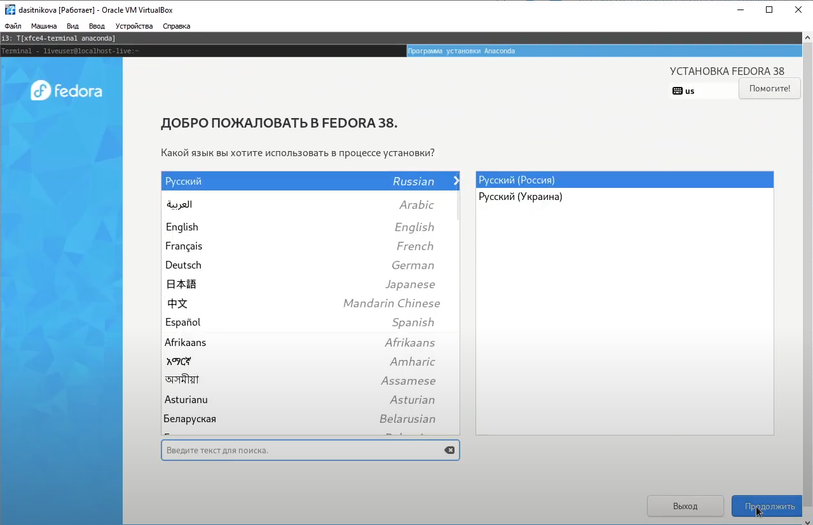{ #fig:001 width=100% }

## Настройка автоматических подписей коммитов git

* Используя введёный email, укажите Git применять его при подписи коммитов:  
  git config --global user.signingkey <PGP Fingerprint>  
  git config --global commit.gpgsign true  
  git config --global gpg.program S(which gpg2)(рис. [-@fig:013])  
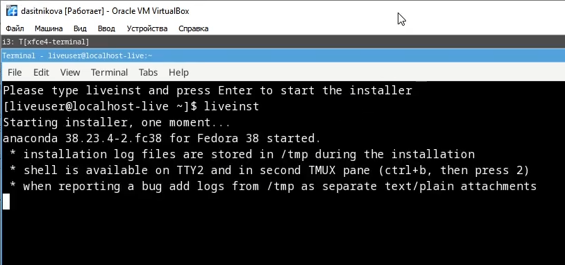{ #fig:001 width=100% }

## Настройка gh

* Для начала необходимо авторизоваться  
  gh auth login
* Утилита задаст несколько наводящих вопросов.(рис. [-@fig:014])  
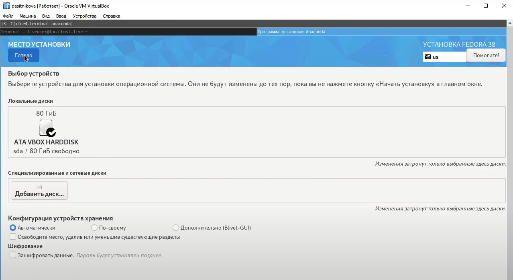{ #fig:001 width=100% }  
* Авторизоваться можно через браузер.(рис. [-@fig:015])(рис. [-@fig:016])  
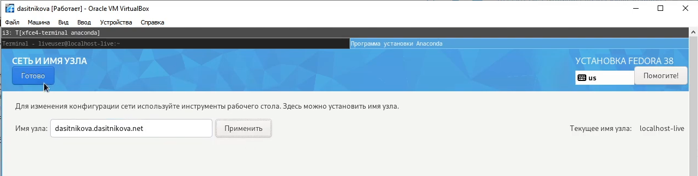{ #fig:001 width=100% }  
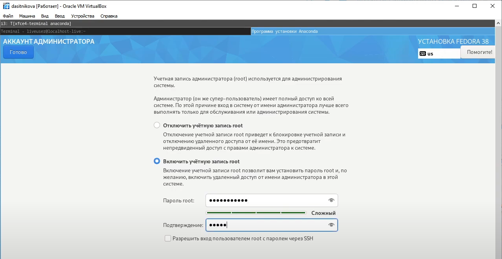{ #fig:001 width=100% }  
* Результат выполнения корректной работы по настройке gh:(рис. [-@fig:017])  
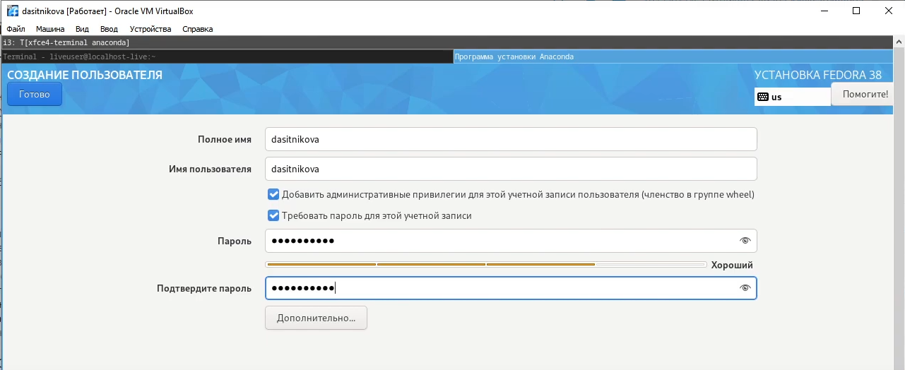{ #fig:001 width=100% }

## Сознание репозитория курса на основе шаблона

* Необходимо создать шаблон рабочего пространства (см. Рабочее пространство для лабораторной работы).
* Например, для 2022–2023 учебного года и предмета «Операционные системы» (код предмета os-intro) создание репозитория примет следующий вид:  
  mkdir -p ~/work/study/2022-2023/"Операционные системы"  
  cd ~/work/study/2022-2023/"Операционные системы" 
  gh repo create study_2022-2023_os-intro --template=yamadharma/course-directory-student-template --public  
  git clone --recursive git@github.com:<owner>/study_2022-2023_os-intro.git os-intro(рис. [-@fig:018])(рис. [-@fig:019])  
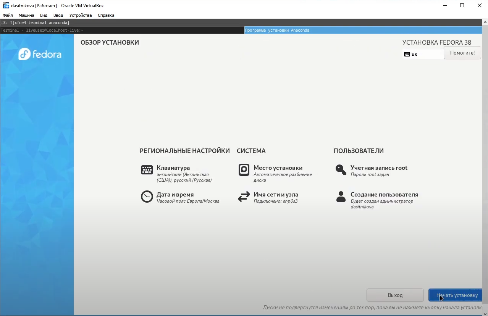{ #fig:001 width=100% }  
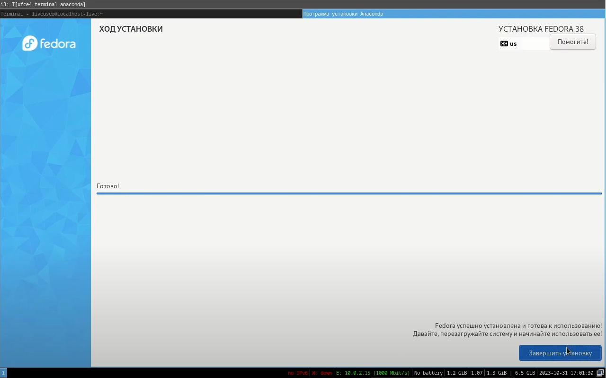{ #fig:001 width=100% }

## Настройка каталога курса

* Перейдите в каталог курса:  
  cd ~/work/study/2022-2023/"Операционные системы"/os-intro
* Удалите лишние файлы:  
  rm package.json
* Создайте необходимые каталоги:  
  echo os-intro > COURSE  
  make(рис. [-@fig:020])  
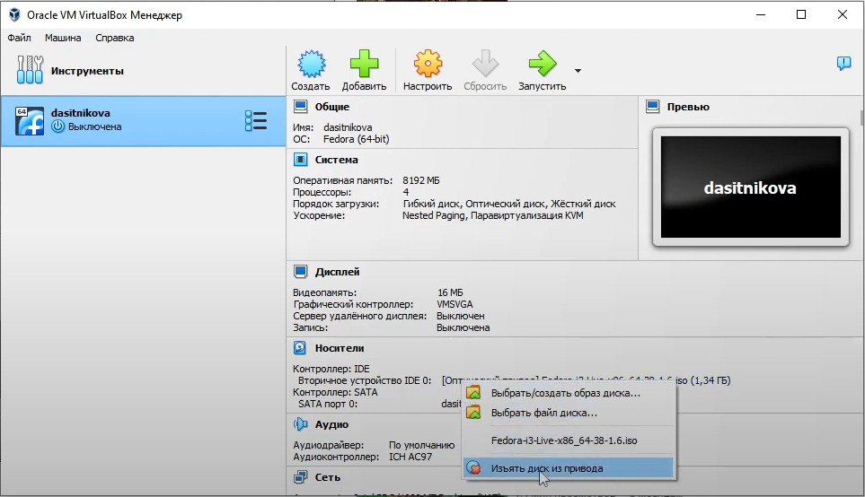{ #fig:001 width=100% }  
* Отправьте файлы на сервер:  
  git add .  
  git commit -am 'feat(main): make course structure'  
  git push(рис. [-@fig:021])  
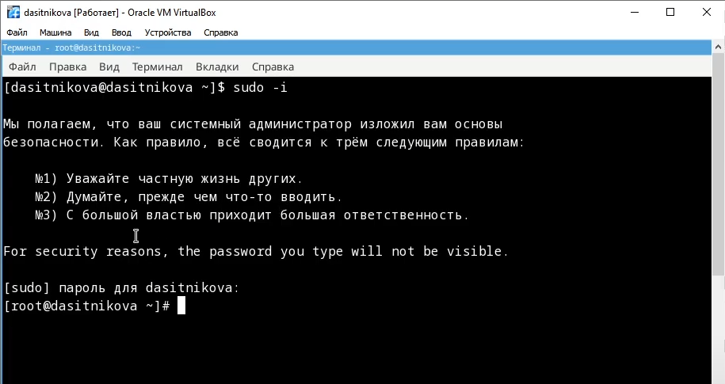{ #fig:001 width=100% }  
Примечание: если при коммите выводит ошибку как на "Рис21", может помочь команда  
export GPG_TTY=$(tty)

# Контрольные вопросы

1. **Что такое системы контроля версий (VCS) и для решения каких задач они предназначаются?**  
   Это программное обеспечение для облегчения работы с изменяющейся информацией. VCS позволяет хранить несколько версий одного и того же документа, при необходимости возвращаться к более ранним версиям, определять, кто и когда сделал то или иное изменение, и многое другое.
2. **Объясните следующие понятия VCS и их отношения: хранилище, commit, история, рабочая копия.**  
   Хранилище (repository), или репозитарий, — место хранения всех версий и служебной информации.  
   Commit («[трудовой] вклад», не переводится) — синоним версии; процесс создания новой версии.  
   История – место, где сохраняются все коммиты, по которым можно посмотреть данные о коммитах.  
   Рабочая копия – текущее состояние файлов проекта, основанное на версии, загруженной из хранилища.
3. **Что представляют собой и чем отличаются централизованные и децентрализованные VCS? Приведите примеры VCS каждого вида.**  
   Централизованные VCS: одно основное хранилище всего проекта и каждый пользователь копирует себе необходимые ему файлы из этого репозитория, изменяет и, затем, добавляет свои изменения обратно. Например: CVS (Concurrent Versions System, Система одновременных версий), Subversion (SVN).  
   Децентрализованные VCS: у каждого пользователя свой вариант (возможно не один) репозитория. Например: Git и Mercurial.
4. **Опишите действия с VCS при единоличной работе с хранилищем.**
  * Инициализация репозитория: Создайте новый репозиторий VCS для вашего проекта. В большинстве систем управления версиями это делается командой "init" или подобной.
  * Добавление файлов: Добавьте все файлы вашего проекта в репозиторий. Это позволяет начать отслеживать изменения в ваших файлах.
  * Создание коммитов: После внесения изменений в файлы сделайте коммиты, чтобы сохранить текущее состояние в репозитории. Коммиты могут включать описание ваших изменений.
  * Откат к предыдущим версиям: Если вы сделали изменения, которые вы хотите откатить, VCS позволяет вам вернуться к предыдущим версиям файлов или к более старым коммитам.
  * Просмотр истории: VCS сохраняет историю всех ваших коммитов. Вы можете просматривать историю, смотреть, какие изменения были внесены в каждом коммите.
  * Ветвление и слияние: В случае необходимости, вы можете создавать ветки (branches) для разработки разных функций или экспериментов. Вы также можете сливать ветки, чтобы объединить изменения из разных веток.
  * Работа с удаленным репозиторием: Даже при индивидуальной работе с VCS, вы можете создать удаленный репозиторий (например, на платформе GitHub или GitLab) для резервного копирования и совместного доступа к своему коду с разных устройств.
  * Резервное копирование: Регулярно отправляйте свои изменения на удаленный репозиторий или делайте резервное копирование локальных репозиториев для предотвращения потери данных.
5. **Опишите порядок работы с общим хранилищем VCS.**
  * Выбор VCS и настройка: В начале проекта выберите VCS, который лучше всего соответствует вашим потребностям. Популярными системами управления версиями являются Git, SVN, Mercurial, и другие. Установите и настройте выбранную систему на вашем компьютере.
  * Инициализация репозитория: Создайте новый репозиторий (хранилище) VCS для вашего проекта. Это можно сделать с помощью команды init или аналогичной в зависимости от выбранной системы.
  * Добавление файлов: Добавьте все файлы вашего проекта в локальный репозиторий. В Git, это делается с помощью команды git add, в SVN - команды svn add, и так далее.
  * Создание коммитов: После добавления файлов, создайте коммиты (snapshots) для сохранения текущего состояния вашего проекта в локальном репозитории. Коммиты должны сопровождаться описанием ваших изменений. В Git, коммиты создаются с помощью команды git commit, в SVN - svn commit.
  * Работа с удаленным репозиторием: Если у вас есть общий проект с другими разработчиками, существует удаленный репозиторий на сервере. Вы можете клонировать (создать локальную копию) этого удаленного репозитория с помощью команды git clone, svn checkout, и других в зависимости от системы VCS.
  * Работа над проектом: Вы и другие разработчики можете работать над проектом, внося изменения в файлы в вашей локальной копии. По мере работы, регулярно создавайте коммиты, чтобы сохранить изменения в вашем локальном репозитории.
  * Отправка изменений: Когда вы готовы поделиться своими изменениями с другими участниками проекта, отправьте их на удаленный репозиторий с помощью команды git push, svn commit, или аналогичных команд в других системах.
  * Обновление локальной копии: Для получения изменений, внесенных другими участниками проекта, используйте команду обновления (git pull, svn update и др.).
  * Работа с ветками: При необходимости, создавайте и работайте с ветками (branches) для разработки разных функций. Ветвление и слияние (merge) - важные аспекты работы с VCS.
  * Решение конфликтов: Если возникают конфликты при слиянии изменений, решайте их вручную и сохраняйте изменения в конфликтных файлах.
  * Отслеживание истории: VCS сохраняет историю всех изменений в проекте. Вы можете просматривать историю, анализировать изменения и возвращаться к предыдущим версиям при необходимости.
  * Резервное копирование: Регулярно сохраняйте резервные копии вашего локального репозитория и удаленного репозитория, чтобы избежать потери данных.
6. **Каковы основные задачи, решаемые инструментальным средством git?**  
  Git — это система управления версиями. У Git две основных задачи:
  * хранить информацию о всех изменениях в вашем коде, начиная с самой первой строчки
  * обеспечение удобства командной работы над кодом.
7. **Назовите и дайте краткую характеристику командам git.**
  * Создание основного дерева репозитория:  
    git init
  * Получение обновлений (изменений) текущего дерева из центрального репозитория:  
    git pull
  * Отправка всех произведённых изменений локального дерева в центральный репозиторий:  
    git push
  * Просмотр списка изменённых файлов в текущей директории:  
    git status
  * Просмотр текущих изменений:  
    git diff
  * Сохранение текущих изменений:
    * добавить все изменённые и/или созданные файлы и/или каталоги:  
      git add .
    * добавить конкретные изменённые и/или созданные файлы и/или каталоги:  
      git add имена_файлов
    * удалить файл и/или каталог из индекса репозитория (при этом файл и/или каталог остаётся в локальной директории):  
      git rm имена_файлов
  * Сохранение добавленных изменений:
    * сохранить все добавленные изменения и все изменённые файлы:  
      git commit -am 'Описание коммита'
    * сохранить добавленные изменения с внесением комментария через встроенный редактор:  
      git commit
    * создание новой ветки, базирующейся на текущей:  
      git checkout -b имя_ветки
    * переключение на некоторую ветку:  
      git checkout имя_ветки
      * (при переключении на ветку, которой ещё нет в локальном репозитории, она будет создана и связана с удалённой)
    * отправка изменений конкретной ветки в центральный репозиторий:  
      git push origin имя_ветки
    * слияние ветки с текущим деревом:  
      git merge --no-ff имя_ветки
  * Удаление ветки:
    * удаление локальной уже слитой с основным деревом ветки:  
      git branch -d имя_ветки
    * принудительное удаление локальной ветки:  
      git branch -D имя_ветки
    * удаление ветки с центрального репозитория:  
      git push origin :имя_ветки
8. **Приведите примеры использования при работе с локальным и удалённым репозиториями.**  
  Работа с локальным репозиторием:
  * git init: Инициализация нового локального репозитория.
  * git clone <URL>: Клонирование удаленного репозитория в локальную директорию.
  * git status: Показ текущего состояния локального репозитория, включая измененные, добавленные и неотслеживаемые файлы.
  * git add <file>: Добавление файла в индекс, подготовка к коммиту.
  * git commit -m "Сообщение коммита": Создание коммита с сообщением, описывающим внесенные изменения.
  * git log: Просмотр истории коммитов в локальном репозитории.
  * git branch: Просмотр списка веток в репозитории.
  * git checkout <branch>: Переключение на другую ветку.
  * git merge <branch>: Слияние изменений из указанной ветки в текущую.
  * git reset <commit>: Откат на определенный коммит, отмена изменений.  
  Работа с удаленным репозиторием:
  * git remote -v: Просмотр списка удаленных репозиториев, связанных с текущим локальным репозиторием.
  * git pull <remote> <branch>: Получение изменений с удаленного репозитория и объединение их с текущей веткой.
  * git push <remote> <branch>: Отправка своих локальных изменений на удаленный репозиторий.
  * git fetch <remote>: Получение информации о состоянии удаленного репозитория без слияния изменений.
  * git clone <URL>: Клонирование удаленного репозитория в локальную директорию.
9. **Что такое и зачем могут быть нужны ветви (branches)?**  
    Ветки нужны, чтобы несколько программистов могли вести работу над одним и тем же проектом или даже файлом одновременно, при этом не мешая друг другу. Кроме того, ветки используются для тестирования экспериментальных функций: чтобы не повредить основному проекту, создается новая ветка специально для экспериментов.
10. **Как и зачем можно игнорировать некоторые файлы при commit?**  
  Игнорируемые файлы — это, как правило, артефакты сборки и файлы, генерируемые машиной из исходных файлов в вашем репозитории, либо файлы, которые по какой-либо иной причине не должны попадать в коммиты.  

# Выводы

