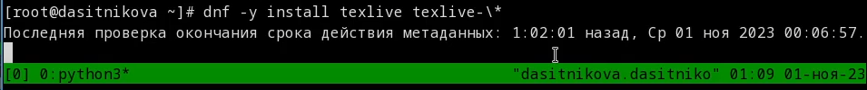

---
## Front matter
title: Отчет по лабораторной работе №1
subtitle: "Дисциплина: Операционные системы"
author: "Ситникова Диана Александровна"
description: "Группа: НПИбд-01-22"
date: "Москва 2023г"

## Generic otions
lang: ru-RU
toc-title: "Содержание"

## Bibliography
bibliography: bib/cite.bib
csl: pandoc/csl/gost-r-7-0-5-2008-numeric.csl

## Pdf output format
toc: true # Table of contents
toc-depth: 2
lof: true # List of figures
lot: true # List of tables
fontsize: 12pt
linestretch: 1.5
papersize: a4
documentclass: scrreprt
## I18n polyglossia
polyglossia-lang:
  name: russian
  options:
    - spelling=modern
    - babelshorthands=true
polyglossia-otherlangs:
  name: english
## I18n babel
babel-lang: russian
babel-otherlangs: english
## Fonts
mainfont: PT Serif
romanfont: PT Serif
sansfont: PT Sans
monofont: PT Mono
mainfontoptions: Ligatures=TeX
romanfontoptions: Ligatures=TeX
sansfontoptions: Ligatures=TeX,Scale=MatchLowercase
monofontoptions: Scale=MatchLowercase,Scale=0.9
## Biblatex
biblatex: true
biblio-style: "gost-numeric"
biblatexoptions:
  - parentracker=true
  - backend=biber
  - hyperref=auto
  - language=auto
  - autolang=other*
  - citestyle=gost-numeric
## Pandoc-crossref LaTeX customization
figureTitle: "Рис."
tableTitle: "Таблица"
listingTitle: "Листинг"
lofTitle: "Список иллюстраций"
lolTitle: "Листинги"
## Misc options
indent: true
header-includes:
  - \usepackage{indentfirst}
  - \usepackage{float} # keep figures where there are in the text
  - \floatplacement{figure}{H} # keep figures where there are in the text
---

# Цель работы

Целью данной работы является приобретение практических навыков установки операционной системы на виртуальную машину, настройки минимально необходимых для дальнейшей работы сервисов.  

# Выполнение лабораторной работы

## Установка программного обеспечения

Произведём скачивание и установку виртуальной машины через сайт(рис. [-@fig:001])  
{ #fig:001 width=100% }  
[https://www.virtualbox.org/](https://www.virtualbox.org/)  
Далее скачаем дистрибутив Linux Fedora-35(рис. [-@fig:002])  
{ #fig:002 width=100% }  
[https://getfedora.org/ru/workstation/download](https://fedoraproject.org/spins/i3/download/)  

## Создание виртуальной машины

* Запустите менеджер виртуальных машин.  
* Создайте новую виртуальную машину.  
* Укажите имя виртуальной машины (ваш логин в дисплейном классе), тип операционной системы — Linux, Fedora(рис. [-@fig:003])  
{ #fig:003 width=100% }  
* Укажите размер основной памяти виртуальной машины — от 2048 МБ(рис. [-@fig:004])  
{ #fig:004 width=100% }  
* Задайте конфигурацию жёсткого диска — загрузочный, VDI (VirtualBox Disk Image), динамический виртуальный диск.  
* Задайте размер диска — 80 ГБ (или больше), его расположение — в данном случае /var/tmp/имя_пользователя/fedora.vdi(рис. [-@fig:005])  
{ #fig:005 width=100% }  
* Выберите в VirtualBox Вашей виртуальной машины. Добавьте новый привод оптических дисков и выберите образ.  
* При установке на собственной технике используйте скачанный образ операционной системы Fedora(рис. [-@fig:006])  
{ #fig:006 width=100% }  
* Общий вид виртуальной машины(рис. [-@fig:007]):  
{ #fig:007 width=100% }  
* Настройка виртуальной машины на двунаправленый буфер обмена(рис. [-@fig:008]):  
{ #fig:008 width=100% }  

## Установка операционной системы

* Запуск приложения для установки системы  
  * Загрузите LiveCD(рис. [-@fig:009]):  
{ #fig:009 width=100% }  
  * Появится интерфейс начальной конфигурации.  
  * Нажмите Enter для создания конфигурации по умолчанию(рис. [-@fig:010]):  
{ #fig:010 width=100% }  
  * Нажмите Enter, чтобы выбрать в качестве модификатора клавишу Win (она же клавиша Super)(рис. [-@fig:011]):  
{ #fig:011 width=100% }  
  * В файле конфигурации эта клавиша будет обозначена как $Mod.  
  * Нажмите комбинацию Win+Enter для запуска терминала.  
  * В терминале запустите liveinst(рис. [-@fig:012]):  
{ #fig:012 width=100% }  
  * Для перехода к раскладке окон с табами нажмите Win+w.  

* Установка системы на диск  
  * Выберите язык интерфейса и перейдите к настройкам установки операционной системы(рис. [-@fig:013]):  
{ #fig:013 width=100% }  
  * При необходимости скорректируйте часовой пояс, раскладку клавиатуры (рекомендуется в качестве языка по умолчанию указать английский язык).  
  * Место установки ОС оставьте без изменения(рис. [-@fig:014]):  
{ #fig:014 width=100% }  
  * Установите имя и пароль для пользователя root(рис. [-@fig:016]):  
{ #fig:016 width=100% }  
  * Установите имя и пароль для Вашего пользователя(рис. [-@fig:017]):  
{ #fig:017 width=100% }  
  * Задайте сетевое имя Вашего компьютера(рис. [-@fig:015]):  
{ #fig:015 width=100% }  
  * После завершения установки операционной системы корректно перезапустите виртуальную машину(рис. [-@fig:018]):  
{ #fig:018 width=100% }  
  * В VirtualBox оптический диск должен отключиться автоматически, но если это не произошло, то необходимо отключить носитель информации с образом(рис. [-@fig:020]):  
{ #fig:020 width=100% }  

## После установки

* Войдите в ОС под заданной вами при установке учётной записью.  
* Нажмите комбинацию Win+Enter для запуска терминала.  
* Переключитесь на роль супер-пользователя:  
  sudo -i  
  (рис. [-@fig:021]): { #fig:021 width=100% }  
* Обновить все пакеты  
  dnf -y update  
  (рис. [-@fig:022]): { #fig:022 width=100% }  
* Установить программы для удобства работы в консоли:  
  dnf install tmux mc  
  (рис. [-@fig:023]): { #fig:023 width=100% }  
* При необходимости можно использовать автоматическое обновление.  
* Установка программного обеспечения:  
  dnf install dnf-automatic  
  (рис. [-@fig:024]): { #fig:024 width=100% }  
* Задаёте необходимую конфигурацию в файле /etc/dnf/automatic.conf.  
* Запустите таймер:  
  systemctl enable --now dnf-automatic.timer  
  (рис. [-@fig:025]): { #fig:025 width=100% }  
* В данном курсе мы не будем рассматривать работу с системой безопасности SELinux. Поэтому отключим его:  
  * В файле /etc/selinux/config замените значение **SELINUX=enforcing** на значение **SELINUX=permissive**  
    (рис. [-@fig:027]): { #fig:027 width=100% }  
* Перегрузите виртуальную машину: **reboot**

## Установка драйверов для VirtualBox

* Войдите в ОС под заданной вами при установке учётной записью.
* Нажмите комбинацию Win+Enter для запуска терминала.
* Запустите терминальный мультиплексор tmux:  
  tmux
* Переключитесь на роль супер-пользователя:  
  sudo -i
* Установите пакет DKMS:  
  dnf -y install dkms  
  (рис. [-@fig:028]): { #fig:028 width=100% }  
* В меню виртуальной машины подключите образ диска дополнений гостевой ОС(рис. [-@fig:029]):  
  { #fig:029 width=100% }  
* Подмонтируйте диск:  
  mount /dev/sr0 /media
  (рис. [-@fig:031]): { #fig:031 width=100% }  
* Установите драйвера:  
  /media/VBoxLinuxAdditions.run  
  (рис. [-@fig:030]): { #fig:030 width=100% }  
* Перегрузите виртуальную машину:  
  reboot

## Установка имени пользователя и названия хоста

* Если при установке виртуальной машины вы задали имя пользователя или имя хоста, не удовлетворяющее соглашению об именовании, то вам необходимо исправить это.
* Запустите виртуальную машину и залогиньтесь.
* Нажмите комбинацию Win+Enter для запуска терминала.
* Запустите терминальный мультиплексор tmux:  
  tmux
* Переключитесь на роль супер-пользователя:
  sudo -i
* Создайте пользователя (вместо username укажите ваш логин в дисплейном классе):  
  adduser -G wheel username
* Задайте пароль для пользователя (вместо username укажите ваш логин в дисплейном классе):
  passwd username
* Установите имя хоста (вместо username укажите ваш логин в дисплейном классе):
  hostnamectl set-hostname username
* Проверьте, что имя хоста установлено верно:
  hostnamectl  
(рис. [-@fig:032]): { #fig:032 width=100% }  

## Установка программного обеспечения для создания документации

* Войдите в ОС под заданной вами при установке учётной записью.  
* Нажмите комбинацию Win+Enter для запуска терминала.  
* Запустите терминальный мультиплексор tmux:  
  tmux  
* Переключитесь на роль супер-пользователя:  
  sudo -i  
* Установим pandoc:  
  dnf -y install pandoc  
  (рис. [-@fig:033]): { #fig:033 width=100% }  
* Установим pip:  
  dnf install python-pip  
  (рис. [-@fig:036]): { #fig:036 width=100% }  
* Установите необходимые расширения:  
  pip install pandoc-fignos pandoc-eqnos pandoc-tablenos pandoc-secnos --user
  (рис. [-@fig:037]): { #fig:037 width=100% }  
* Проверим наличие lualtex, pdflatex и xelatex(рис. [-@fig:035]):  
  { #fig:035 width=100% }  
* Установим дистрибутив TeXlive:
  dnf -y install texlive texlive-\*
(рис. [-@fig:034]): { #fig:034 width=100% }  
* 

## Домашнее задание

* Дождитесь загрузки графического окружения и откройте терминал. В окне терминала проанализируйте последовательность загрузки системы, выполнив команду dmesg. Можно просто просмотреть вывод этой команды:
  dmesg | less  
  (рис. [-@fig:038]): { #fig:038 width=100% }  
* Можно использовать поиск с помощью grep:
  dmesg | grep -i "то, что ищем"
* Получите следующую информацию:  
  * Версия ядра Linux (Linux version)(рис. [-@fig:039]).  
  * Частота процессора (Detected Mhz processor)(рис. [-@fig:039]).  
  * Модель процессора (CPU0)(рис. [-@fig:039]):  
    { #fig:039 width=100% }  
  * Объём доступной оперативной памяти (Memory available)(рис. [-@fig:040]):  
    { #fig:040 width=100% }  
  * Тип обнаруженного гипервизора (Hypervisor detected)(рис. [-@fig:041]):  
    { #fig:041 width=100% }  
  * Тип файловой системы корневого раздела(рис. [-@fig:042]): **findmnt**  
    { #fig:042 width=100% }  
  * Последовательность монтирования файловых систем(рис. [-@fig:043]):  
    { #fig:043 width=100% }  

# Контрольные вопросы

1. **Какую информацию содержит учётная запись пользователя?**  
  * Имя пользователя (Username): Это уникальное имя, которое идентифицирует пользователя в системе. Имя пользователя обычно используется при входе в систему.
  * Идентификатор пользователя (User ID - UID): Это числовой идентификатор, присвоенный каждому пользователю. UID 0 (ноль) обычно зарезервирован для суперпользователя (root).
  * Идентификатор группы (Group ID - GID): Это числовой идентификатор группы, к которой принадлежит пользователь. Каждый пользователь также принадлежит к одной или нескольким группам.
  * Домашний каталог (Home Directory): Это каталог, который служит домашним для пользователя. При входе в систему пользователь обычно начинает в этом каталоге.
  * Оболочка (Shell): Это программа, которая предоставляет пользовательский интерфейс для взаимодействия с операционной системой. Когда пользователь входит в систему, используется указанная оболочка.
  * Полное имя пользователя (Full Name): Это человекочитаемое имя пользователя или его настоящее имя.
  * Пароль (Password): Хэшированный пароль пользователя, хранящийся в файле /etc/shadow. Реальный пароль недоступен и заменён хэшем.
  * Дата создания учётной записи (Creation Date): Дата и время, когда учётная запись была создана.
2. **Укажите команды терминала и приведите примеры:**  
   * для получения справки по команде: **man <команда> (man ls)**  
   * для перемещения по файловой системе: **cd <каталог> (cd / - перемещение в корневой каталог)**  
   * для просмотра содержимого каталога: **ls <каталог если нужно> (ls / - содержимое корневого каталога)**  
   * для определения объёма каталога: **du -s <каталог> (du -s /etc)**  
   * для создания / удаления каталогов / файлов:
     * Создание каталога: **mkdir название_каталога** (Пример: mkdir Documents)  
     * Создание каталога и всех промежуточных каталогов: **mkdir -p путь/к/каталогу** (Пример: mkdir -p Documents/Projects/Code)
     * Создание файла: **touch название_файла** (Пример: touch example.txt)
     * Удаление файла: **rm название_файла** (Пример: rm example.txt)
     * Удаление каталога (если пуст): **rmdir название_каталога** (Пример: rmdir Documents)
     * Удаление каталога и его содержимого (рекурсивное удаление): **rm -r название_каталога** (Пример: rm -r Documents)
     * Удаление файла с подтверждением (запросит подтверждение перед удалением): **rm -i название_файла** (Пример: rm -i example.txt)
   * для задания определённых прав на файл / каталог: chmod <ххх> <имя> (chmod 777 some.txt)  
   * для просмотра истории команд: history  
3. **Что такое файловая система? Приведите примеры с краткой характеристикой.**  
   Файловая система в Linux - это способ организации данных на устройствах хранения, таких как жесткие диски и флеш-накопители. Она определяет, как файлы и каталоги организованы и как к ним можно обращаться. Вот несколько примеров файловых систем в Linux:
  * Ext4 (Fourth Extended Filesystem):  
    Характеристики: Расширение Ext4 является стандартной файловой системой для многих дистрибутивов Linux. Он предоставляет хорошую производительность и поддерживает большие объемы данных и файлы.  
    Преимущества: Журналирование, поддержка файлов размером до 16 терабайт, поддержка файловых систем размером до 1 экзабайт.  
    Пример монтирования: mount -t ext4 /dev/sdX /mnt/mydrive  
  * Btrfs (B-tree File System):  
    Характеристики: Btrfs является современной файловой системой, которая поддерживает копирование при записи, снимки, сжатие и другие функции.  
    Преимущества: Управление снимками, копирование при записи (COW), поддержка RAID и объединение устройств.  
    Пример монтирования: mount -t btrfs /dev/sdX /mnt/mydrive  
  * XFS (X File System):  
    Характеристики: XFS обеспечивает высокую производительность при работе с большими файлами и высокими объемами данных. Он хорошо подходит для серверных приложений.  
    Преимущества: Поддержка высоких производительностных требований, отличная обработка больших файлов.  
    Пример монтирования: mount -t xfs /dev/sdX /mnt/mydrive  
  * ZFS (Zettabyte File System):  
    Характеристики: ZFS предоставляет функции управления данными, такие как объединение устройств, снимки и проверка целостности данных.  
    Преимущества: Мгновенные снимки, объединение устройств, проверка целостности данных.  
    Пример монтирования: zpool import poolname  
  * F2FS (Flash-Friendly File System):  
    Характеристики: F2FS оптимизирована для флеш-накопителей, обеспечивая высокую производительность для устройств хранения на основе NAND-флеш-памяти.  
    Преимущества: Эффективное управление флеш-памятью, высокая производительность на устройствах с флеш-памятью.  
    Пример монтирования: mount -t f2fs /dev/sdX /mnt/mydrive  
4. **Как посмотреть, какие файловые системы подмонтированы в ОС?**
  * Можно использовать команду df (от "disk free") для просмотра информации о подмонтированных файловых системах: **df -h**  
    Параметр *-h делает вывод более читаемым для человека, представляя размеры в более удобных единицах (гигабайтах, мегабайтах и т. д.). Эта команда отобразит список всех подмонтированных файловых систем, их размер, использование и точку монтирования.
  * Если необходима информация только о конкретной файловой системе или точке монтирования, можно указать путь к точке монтирования: **df -h /путь/к/точке/монтирования**  
  * Команда **mount** отобразит текущие точки монтирования и использованные файловые системы. Эта команда покажет не только файловые системы, но и другую информацию о монтировании, такую как опции монтирования и т. д.
5. **Как удалить зависший процесс?**  
  Для удаления (или, точнее, завершения) зависшего процесса в Linux вы можете воспользоваться командой kill. Вот несколько шагов:
  * Узнайте PID (идентификатор процесса) зависшего процесса:  
    * Вы можете использовать команду ps для просмотра списка процессов. Например: **ps aux | grep имя_процесса**  
      Это покажет вам список процессов, и вы сможете определить PID зависшего процесса.  
  * Используйте команду kill для завершения процесса: **kill -9 PID**  
    Где PID - это идентификатор процесса, который вы определили на предыдущем шаге.  
    Опция -9 представляет собой "сигнал уничтожения" (SIGKILL), который принудительно завершает процесс. Если обычный сигнал kill не срабатывает, -9 может быть более настойчивым.
  * Проверьте, был ли процесс завершен:  
    Вы можете снова использовать **ps** или **htop** для проверки, что процесс больше не активен.  
  Если процесс по-прежнему не завершается, то, возможно, есть проблемы более высокого уровня, и инструменты, такие как **strace** или **gdb**, могут понадобиться для дальнейшего анализа и устранения проблемы.

# Выводы

В ходе данной работы я приобрела практические навыки установки операционной системы на виртуальную машину и настройки минимально необходимых для дальнейшей работы сервисов.
