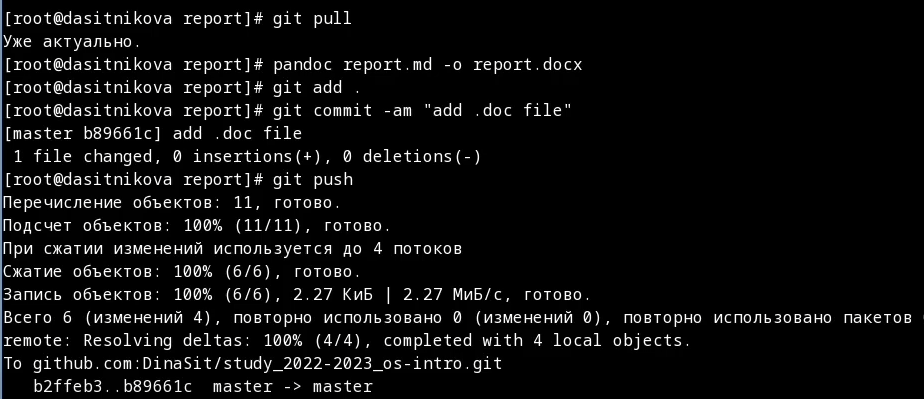
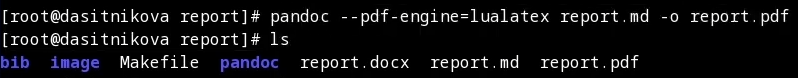
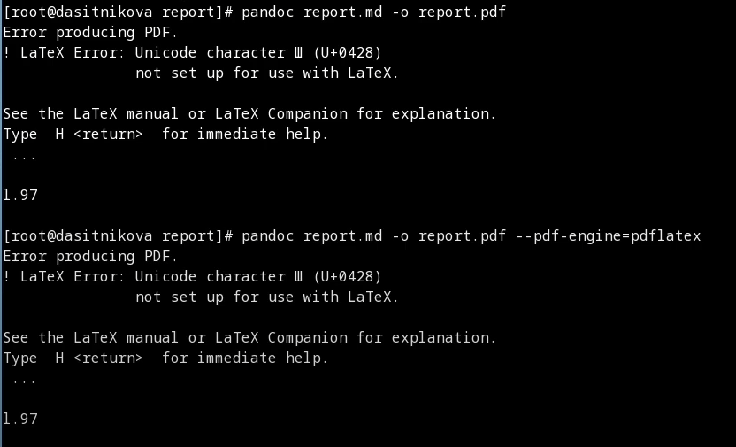

---
## Front matter
title: Отчет по лабораторной работе №3
subtitle: "Дисциплина: Операционные системы"
author: "Ситникова Диана Александровна"
description: "Группа: НПИбд-01-22"
date: "Москва 2023г"

## Generic otions
lang: ru-RU
toc-title: "Содержание"

## Bibliography
bibliography: bib/cite.bib
csl: pandoc/csl/gost-r-7-0-5-2008-numeric.csl

## Pdf output format
toc: true # Table of contents
toc-depth: 2
lof: true # List of figures
lot: true # List of tables
fontsize: 12pt
linestretch: 1.5
papersize: a4
documentclass: scrreprt
## I18n polyglossia
polyglossia-lang:
  name: russian
  options:
    - spelling=modern
    - babelshorthands=true
polyglossia-otherlangs:
  name: english
## I18n babel
babel-lang: russian
babel-otherlangs: english
## Fonts
mainfont: PT Serif
romanfont: PT Serif
sansfont: PT Sans
monofont: PT Mono
mainfontoptions: Ligatures=TeX
romanfontoptions: Ligatures=TeX
sansfontoptions: Ligatures=TeX,Scale=MatchLowercase
monofontoptions: Scale=MatchLowercase,Scale=0.9
## Biblatex
biblatex: true
biblio-style: "gost-numeric"
biblatexoptions:
  - parentracker=true
  - backend=biber
  - hyperref=auto
  - language=auto
  - autolang=other*
  - citestyle=gost-numeric
## Pandoc-crossref LaTeX customization
figureTitle: "Рис."
tableTitle: "Таблица"
listingTitle: "Листинг"
lofTitle: "Список иллюстраций"
lolTitle: "Листинги"
## Misc options
indent: true
header-includes:
  - \usepackage{indentfirst}
  - \usepackage{float} # keep figures where there are in the text
  - \floatplacement{figure}{H} # keep figures where there are in the text
---

# Цель работы

Научиться оформлять отчёты с помощью легковесного языка разметки Markdown.

# Задание

* Сделайте отчёт по предыдущей лабораторной работе в формате Markdown.
* В качестве отчёта просьба предоставить отчёты в 3 форматах: pdf, docx и md (в архиве, поскольку он должен содержать скриншоты, Makefile и т.д.)

# Выполнение лабораторной работы

## Установка программного обеспечения

Для обработки файлов в формате Markdown будем использовать:  
* Pandoc [https://pandoc.org/](https://pandoc.org/). Конкретно, нам понадобится программа pandoc.  
  Я устанавливала Pandoc в Fedora Linux, используя исходный код с репозитория GitHub, выполняя следующие шаги:  
  1. Сначала нам потребуется скачать и установить обновленную версию Pandoc с GitHub. Вы можете воспользоваться следующими командами:  
     Перейдите во временный каталог при помощи команды cd /tmp  
  2. Скачаем архив с GitHub  
     wget https://github.com/jgm/pandoc/releases/download/X.XX/pandoc-X.XX-linux-amd64.tar.gz  
     Заменим X.XX в URL на версию Pandoc, которую хотим установить.  
  3. Распакуем скачанный архив:  
     tar -xvf pandoc-X.XX-linux-amd64.tar.gz  
  4. Перейдем в каталог с распакованными файлами:  
     cd pandoc-X.XX  
  5. Скопируем файл pandoc в каталог, доступный в системе, например, /usr/local/bin:  
     sudo cp pandoc /usr/local/bin/  
  6. Теперь Pandoc должен быть обновлен до версии, которую загрузили с GitHub. Проверим версию Pandoc с помощью команды:  
     pandoc --version  
  Обратите внимание, что обновления и управление зависимостями, возможно, потребуют дополнительных действий, и обновления из официальных репозиториев Fedora обычно более надежны и просты. Используйте этот метод с осторожностью и только в случае необходимости.  
* pandoc-crossref [https://github.com/lierdakil/pandoc-crossref/releases](https://github.com/lierdakil/pandoc-crossref/releases).  
  Я устанавливала Pandoc-crossref в Fedora Linux, используя исходный код с репозитория GitHub, выполняя следующие шаги:  
  1. Убедимся, что на системе установлены необходимые зависимости, такие как GHC (Glasgow Haskell Compiler) и Cabal:  
     sudo dnf install ghc cabal-install  
  2. Клонируем репозиторий Pandoc-crossref с GitHub:  
     git clone https://github.com/lierdakil/pandoc-crossref.git  
  3. Перейдем в каталог, который был создан после клонирования репозитория:  
     cd pandoc-crossref  
  4. Запустим процесс установки Pandoc-crossref с помощью Cabal:  
     cabal install  
     Это может занять некоторое время, так как Cabal будет загружать зависимости и компилировать Pandoc-crossref.  
  5. После установки убедимся, что путь к исполняемому файлу Pandoc-crossref добавлен в переменную окружения PATH. Это позволит вызывать Pandoc-crossref из любого места в терминале.  
     export PATH=$PATH:~/.cabal/bin  
  6. Чтобы сделать это изменение постоянным, добавим указанную строку в файл ~/.bashrc или ~/.bash_profile:  
     echo 'export PATH=$PATH:~/.cabal/bin' >> ~/.bashrc  
  7. Затем выполним source ~/.bashrc, чтобы применить изменения.  
  8. Теперь Pandoc-crossref должен быть установлен на системе. Проверим его, выполнив команду:  
     pandoc-crossref --version  
  Если возникнут проблемы в процессе установки, убедитесь, что у вас установлены все необходимые зависимости и что ваша версия GHC и Cabal совместимы с Pandoc-crossref.
* 

## Оформление отчета по лабораторной работе

* Зададим имя и email владельца репозитория при помощи следующих команд:  
  git config --global user.name "Name Surname"  
  git config --global user.email "work@mail"
* Настроим utf-8 в выводе сообщений git командой:  
  git config --global core.quotepath false(рис. [-@fig:004])  
{ #fig:004 width=100% }  
* Зададим имя начальной ветки (будем называть её master):  
  git config --global init.defaultBranch master
* Параметр autocrlf:  
  git config --global core.autocrlf input
* Параметр safecrlf:  
  git config --global core.safecrlf warn(рис. [-@fig:005])  
{ #fig:005 width=100% }

## Пуш файлов на GitHub

* по алгоритму rsa с ключём размером 4096 бит:  
  ssh-keygen -t rsa -b 4096  
  (см. "Рис5")  
* для копирования ключа нам понадобится команда:  
  cat ~/.ssh/id_rsa.pub(рис. [-@fig:006])  
{ #fig:006 width=100% }  
* далее добавляем скопированный ключ SSH на GitHub:(рис. [-@fig:007])  
{ #fig:007 width=100% }

# Выводы

В ходе выполнения лабораторной работы я научилась оформлять отчёты с помощью легковесного языка разметки Markdown.
